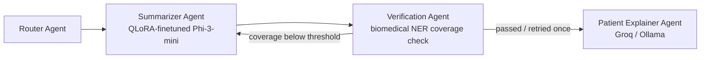

# Synopsis — Multi-Agent Medical Document Summarizer

A 4-agent pipeline (LangGraph) that takes a medical document and produces (1) a **technical
summary** from a model I fine-tuned myself with QLoRA, and (2) a **plain-language explanation**
of that summary via prompt-based generation — with an automated entity-coverage check in
between.



| Phase | Status |
|---|---|
| 1. QLoRA fine-tuning | Notebook complete ([`training/`](training/)); **must be run in your Colab/Kaggle session** — no GPU in this dev environment. Real ROUGE scores land in [`docs/RESULTS.md`](docs/RESULTS.md) once you run it. |
| 2. Multi-agent orchestration + FastAPI | Complete ([`backend/`](backend/)) |
| 3. Testing | Automated tests complete (mocked); real end-to-end sample-document run pending the trained adapter — see [`docs/RESULTS.md`](docs/RESULTS.md) |
| 4. Frontend + deployment | Frontend complete ([`frontend/`](frontend/)); deployment pending — see below |

## Why these choices

- **Base model: `microsoft/Phi-3-mini-4k-instruct`** over Llama-3.2-3B-Instruct — MIT licensed
  and ungated on the HF Hub (Llama 3.2 requires per-account Meta license acceptance), with
  equally strong documented QLoRA support.
- **Dataset: `ccdv/pubmed-summarization`** (subset) — no credentialing required, unlike
  MIMIC-III/IV.
- **Verification: biomedical NER token-classification model**, not scispaCy — simpler to
  containerize for deployment, same underlying idea (extract clinical entities, check overlap).
- **Patient Explainer: Groq primary / Ollama fallback** — reuses the dual-inference pattern from
  my MultiCodeReviewAgent project.

## Repo layout

```
training/   Phase 1 — Colab notebook for QLoRA fine-tuning + real ROUGE eval
backend/    Phase 2/3 — LangGraph agents + FastAPI (POST /summarize) + pytest suite
frontend/   Phase 4 — React + TypeScript + Tailwind clinical-style UI
docs/       Real results and honest write-up of what worked/didn't
```

## Running locally

1. **Train the adapter** — see [`training/README.md`](training/README.md). Requires Colab/Kaggle GPU.
2. **Backend** — see [`backend/README.md`](backend/README.md).
3. **Frontend**:
   ```bash
   cd frontend
   npm install
   cp .env.example .env   # VITE_API_BASE_URL, defaults to http://localhost:8000
   npm run dev
   ```

## Deployment

See [`docs/DEPLOYMENT.md`](docs/DEPLOYMENT.md) for the plan and what's actually been deployed vs.
pending your credentials/accounts.

## Honest limitations

- Verification measures **entity coverage** (does the summary mention entities from the
  source), not factual correctness (right dosage, right laterality, right timing) — a summary
  can pass verification and still contain errors. See `verification_agent.py`'s docstring for
  the full limitations list.
- Substring entity matching misses paraphrases/synonyms (e.g. "MI" vs "myocardial infarction"
  vs "heart attack" are three different strings to this check).
- The NER model was not fine-tuned for this project; its own precision/recall limits bound what
  verification can catch.
- CPU-only inference (the realistic free-tier deployment target) is materially slower than the
  GPU path used for training — this is documented, not hidden, in `summarizer_agent.py`.

This project is a research/portfolio prototype, not a validated clinical tool. See the
disclaimer surfaced directly in the UI.
